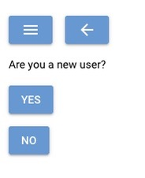
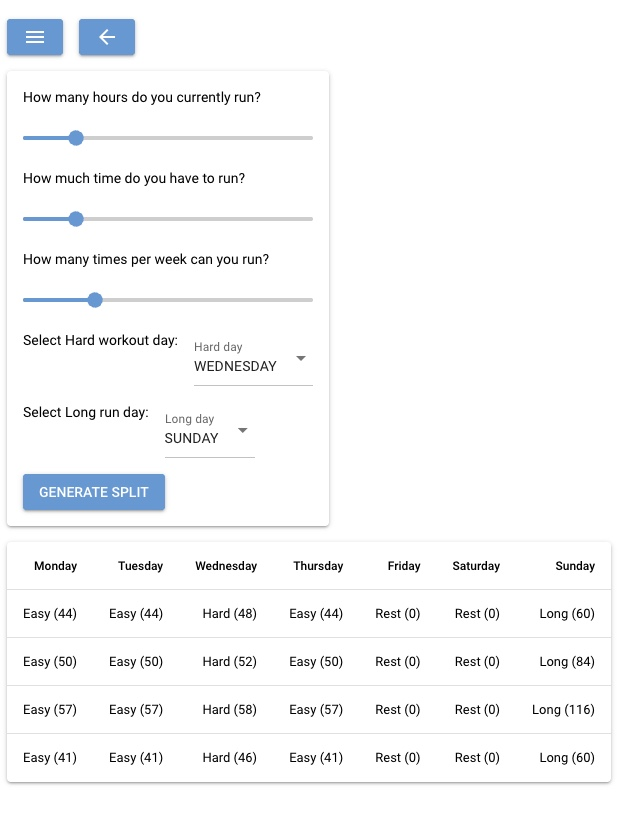

# TrakTiv

## About
This was my first personal project for [Boot.dev](https://www.boot.dev/). All the suggested ideas were pretty cool, but I wanted to build something that I would use myself and would solve one of my daily problems: coming up with a sustainable training plan every 4 weeks and track my activities.

## Tools


## Cloning

## Usage
I suggest running this app in a virtual environment to prevent interfering with your default Python environment. [Learn more about Venv](https://docs.python.org/3/tutorial/venv.html)

Once you've set up your environment run this command in your terminal:
Make sure your working directory is the project directory and your virtual environment is active.

```
pip install -r /traktiv/requirements.txt.
```

With all your dependency installed, you can run the app with 

```
python3 src/main.py
```

This starts the UI in your local server.



From there you can 'Login' or 'Register as a new user'

The menu Icon and the back arrow allow navigation between the different pages

You can log activities, view, edit and delete activities: 


and Generate a 4 Week 'Training Block'




## Challenges

Building a UI was quite the challenge. Choosing a framework that didn’t get in the way of backend-first development took time. NiceGUI eventually fit the bill, but adjusting to its event-driven model was tough.

Coming from a more linear or gameloop-style mindset, thinking in terms of events and handlers required a bit of a mental shift. 
Keeping backend logic clean while wiring up UI interactions was another tricky balance to strike.

## Lessons Learned

Plan your file structure early.
After hacking together a quick prototype, I ended up refactoring most of the code to stay organized and readable. Defining a clear structure from the start saved me pain later.

I landed on a Model–View + Handler pattern — keeping main.py as the entry point and bootstrapper, and splitting the logic cleanly between data models, UI views, and event handlers.
